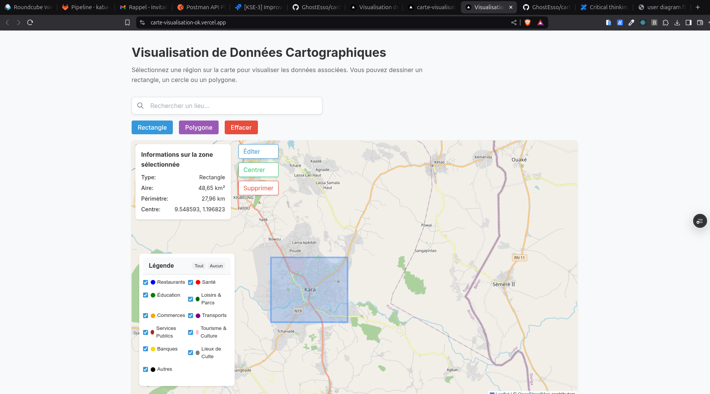
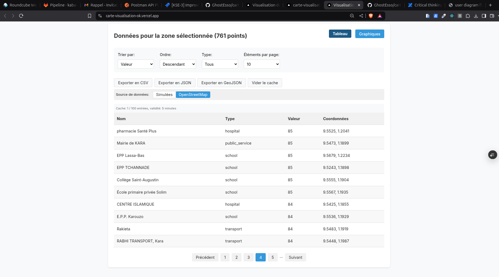
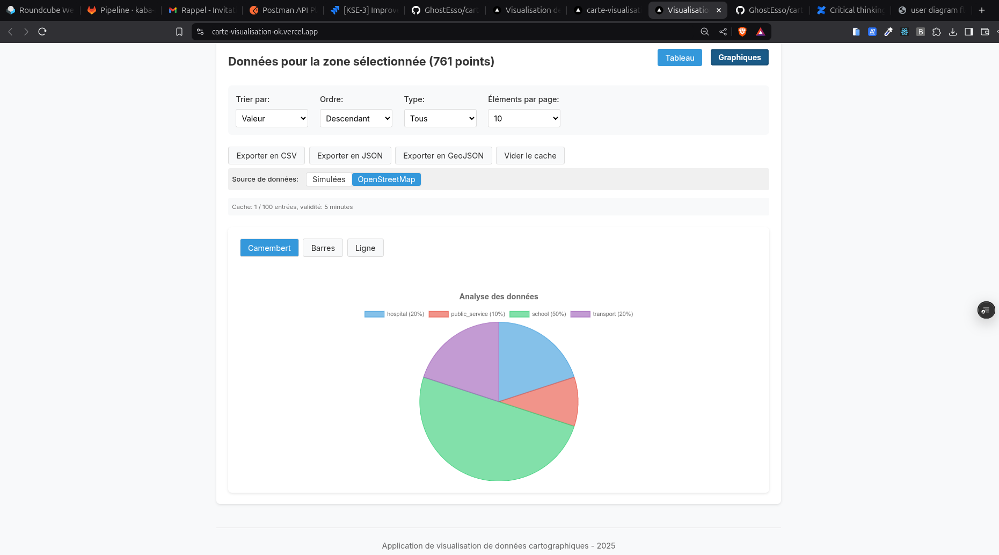

<div align="center" id="readme-top">
  
  <br/>

  <h3><b>Map Visualization</b></h3>

</div>

<!-- TABLE OF CONTENTS -->

# 📗 Table of Contents

- [📖 About the Project](#about-project)
  - [🛠 Built With](#built-with)
    - [Tech Stack](#tech-stack)
    - [Key Features](#key-features)
  - [🚀 Live Demo](#live-demo)
  - [📸 Screenshots](#screenshots)
- [💻 Getting Started](#getting-started)
  - [Prerequisites](#prerequisites)
  - [Setup](#setup)
  - [Install](#install)
  - [Usage](#usage)
  - [Run tests](#run-tests)
  - [Deployment](#deployment)
- [👥 Authors](#authors)
- [🔭 Future Features](#future-features)
- [🤝 Contributing](#contributing)
- [⭐️ Show your support](#support)
- [❓ FAQ](#faq)
- [📝 License](#license)

<!-- PROJECT DESCRIPTION -->

# 📖 Map Visualization <a name="about-project"></a>

**Map Visualization** is an interactive web application that allows users to visualize and analyze geospatial data on a map. It provides drawing tools to select areas and displays statistics and charts for the data within the selected areas.

## 🛠 Built With <a name="built-with"></a>

### Tech Stack <a name="tech-stack"></a>

<details>
  <summary>Client</summary>
  <ul>
    <li><a href="https://nextjs.org/">Next.js</a></li>
    <li><a href="https://reactjs.org/">React.js</a></li>
    <li><a href="https://www.typescriptlang.org/">TypeScript</a></li>
    <li><a href="https://www.chartjs.org/">Chart.js</a></li>
  </ul>
</details>

<details>
  <summary>Mapping</summary>
  <ul>
    <li><a href="https://leafletjs.com/">Leaflet</a></li>
  </ul>
</details>

<details>
  <summary>Data Management</summary>
  <ul>
    <li>API Services with integrated caching</li>
    <li>Data export in CSV, JSON, and GeoJSON formats</li>
  </ul>
</details>

<!-- KEY FEATURES -->

### Key Features <a name="key-features"></a>

- **Area Selection** - Draw circles, rectangles, or polygons on the map to select areas of interest
- **Data Visualization** - View data in tables and charts (pie, bar, line)
- **Filters and Sorting** - Filter and sort data according to different criteria
- **Data Export** - Export data in CSV, JSON, or GeoJSON format
- **Caching System** - Cache system to improve API request performance

<p align="right">(<a href="#readme-top">back to top</a>)</p>

<!-- LIVE DEMO -->

## 🚀 Live Demo <a name="live-demo"></a>

- [Live Demo](https://carte-visualisation-ok.vercel.app/)

<p align="right">(<a href="#readme-top">back to top</a>)</p>

<!-- SCREENSHOTS -->

## 📸 Screenshots <a name="screenshots"></a>

<div align="center">
  
  <p>Vue générale de l'application avec la carte et les outils de dessin</p>
  
  
  <p>Visualisation des données pour une zone sélectionnée</p>
  
  
  <p>Graphiques d'analyse des données géospatiales</p>
</div>

<p align="right">(<a href="#readme-top">back to top</a>)</p>

<!-- GETTING STARTED -->

## 💻 Getting Started <a name="getting-started"></a>

To get a local copy up and running, follow these steps.

### Prerequisites <a name="prerequisites"></a>

To run this project, you need:

- Node.js (v14 or higher)
- npm or yarn

### Setup <a name="setup"></a>

Clone this repository to your local machine:

```sh
  git clone git@github.com:GhostEsso/carte-visualisation.git
  cd carte-visualisation
```

### Install <a name="install"></a>

Install the project dependencies:

```sh
  npm install
  # or
  yarn install
```

### Usage <a name="usage"></a>

To start the development server, run:

```sh
npm run dev
# or
yarn dev
```

Open [http://localhost:3000](http://localhost:3000) in your browser to see the application.

### Run tests <a name="run-tests"></a>

To run tests, use the command:

```sh
  npm test
  # or
  yarn test
```

### Deployment <a name="deployment"></a>

You can deploy this application on Vercel or another hosting service compatible with Next.js:

```sh
  npm run build
  # or
  yarn build
```

<p align="right">(<a href="#readme-top">back to top</a>)</p>

<!-- AUTHORS -->

## 👥 Authors <a name="authors"></a>

👤 **Essohanam Philippe**

- GitHub: [@GhostEsso](https://github.com/GhostEsso)
- LinkedIn: [LinkedIn](https://linkedin.com/in/linkedinhandle)

<p align="right">(<a href="#readme-top">back to top</a>)</p>


<!-- FUTURE FEATURES -->

## 🔭 Future Features <a name="future-features"></a>

- [ ] **Advanced Spatial Analysis** - Addition of spatial analysis features such as distance calculations, buffer zones, etc.
- [ ] **Custom Data Import** - Allow users to import their own datasets for visualization
- [ ] **Visualization Customization** - Provide more customization options for charts and maps

<p align="right">(<a href="#readme-top">back to top</a>)</p>

<!-- CONTRIBUTING -->

## 🤝 Contributing <a name="contributing"></a>

Contributions, issues, and feature requests are welcome!

Feel free to check the [issues page](https://github.com/GhostEsso/carte-visualisation/issues).

<p align="right">(<a href="#readme-top">back to top</a>)</p>

<!-- SUPPORT -->

## ⭐️ Show your support <a name="support"></a>

If you like this project, please give it a star on GitHub and share it with your colleagues!

<p align="right">(<a href="#readme-top">back to top</a>)</p>

<!-- FAQ -->

## ❓ FAQ <a name="faq"></a>

- **Does the application work offline?**

  - No, the application requires an internet connection to load map data and perform API requests.


<!-- LICENSE -->

## 📝 License <a name="license"></a>

This project is licensed under the [MIT](./LICENSE) License.

<p align="right">(<a href="#readme-top">back to top</a>)</p>


