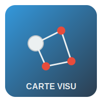

<div align="center" id="readme-top">
  
  <br/>

  <h3><b>Carte Visualisation</b></h3>

</div>

<!-- TABLE OF CONTENTS -->

# 📗 Table des matières

- [📖 À propos du projet](#about-project)
  - [🛠 Technologies utilisées](#built-with)
    - [Stack technique](#tech-stack)
    - [Fonctionnalités clés](#key-features)
  - [🚀 Démo en ligne](#live-demo)
- [💻 Premiers pas](#getting-started)
  - [Prérequis](#prerequisites)
  - [Installation](#setup)
  - [Dépendances](#install)
  - [Utilisation](#usage)
  - [Tests](#run-tests)
  - [Déploiement](#deployment)
- [👥 Auteurs](#authors)
- [🔭 Fonctionnalités futures](#future-features)
- [🤝 Contribuer](#contributing)
- [⭐️ Soutenir le projet](#support)
- [🙏 Remerciements](#acknowledgements)
- [❓ FAQ](#faq)
- [📝 Licence](#license)

<!-- DESCRIPTION DU PROJET -->

# 📖 Carte Visualisation <a name="about-project"></a>

**Carte Visualisation** est une application web interactive permettant de visualiser et d'analyser des données géospatiales sur une carte. Elle offre des outils de dessin pour sélectionner des zones et affiche des statistiques et graphiques pour les données dans les zones sélectionnées.

## 🛠 Technologies utilisées <a name="built-with"></a>

### Stack technique <a name="tech-stack"></a>

<details>
  <summary>Client</summary>
  <ul>
    <li><a href="https://nextjs.org/">Next.js</a></li>
    <li><a href="https://reactjs.org/">React.js</a></li>
    <li><a href="https://www.typescriptlang.org/">TypeScript</a></li>
    <li><a href="https://www.chartjs.org/">Chart.js</a></li>
  </ul>
</details>

<details>
  <summary>Cartographie</summary>
  <ul>
    <li><a href="https://leafletjs.com/">Leaflet</a></li>
  </ul>
</details>

<details>
  <summary>Gestion des données</summary>
  <ul>
    <li>Services API avec cache intégré</li>
    <li>Exportation au format CSV, JSON et GeoJSON</li>
  </ul>
</details>

<!-- FONCTIONNALITÉS CLÉS -->

### Fonctionnalités clés <a name="key-features"></a>

- **Sélection de zones** - Dessinez des cercles, rectangles ou polygones sur la carte pour sélectionner des zones d'intérêt
- **Visualisation de données** - Affichez les données sous forme de tableaux et de graphiques (camembert, barres, lignes)
- **Filtres et tri** - Filtrez et triez les données selon différents critères
- **Exportation des données** - Exportez les données au format CSV, JSON ou GeoJSON
- **Mise en cache** - Système de cache pour améliorer les performances des requêtes API

<p align="right">(<a href="#readme-top">back to top</a>)</p>

<!-- DÉMO EN LIGNE -->

## 🚀 Démo en ligne <a name="live-demo"></a>

- [Démo en ligne](https://carte-visualisation.vercel.app) (à venir)

<p align="right">(<a href="#readme-top">back to top</a>)</p>

<!-- PREMIERS PAS -->

## 💻 Premiers pas <a name="getting-started"></a>

Pour obtenir une copie locale du projet et la faire fonctionner, suivez ces étapes.

### Prérequis <a name="prerequisites"></a>

Pour exécuter ce projet, vous avez besoin de :

- Node.js (v14 ou supérieur)
- npm ou yarn

### Installation <a name="setup"></a>

Clonez ce dépôt sur votre machine locale :

```sh
  git clone git@github.com:GhostEsso/carte-visualisation.git
  cd carte-visualisation
```

### Dépendances <a name="install"></a>

Installez les dépendances du projet :

```sh
  npm install
  # ou
  yarn install
```

### Utilisation <a name="usage"></a>

Pour lancer le serveur de développement, exécutez :

```sh
  npm run dev
  # ou
  yarn dev
```

Ouvrez [http://localhost:3000](http://localhost:3000) dans votre navigateur pour voir l'application.

### Tests <a name="run-tests"></a>

Pour exécuter les tests, utilisez la commande :

```sh
  npm test
  # ou
  yarn test
```

### Déploiement <a name="deployment"></a>

Vous pouvez déployer cette application sur Vercel ou un autre service d'hébergement compatible avec Next.js :

```sh
  npm run build
  # ou
  yarn build
```

<p align="right">(<a href="#readme-top">back to top</a>)</p>

<!-- AUTEURS -->

## 👥 Auteurs <a name="authors"></a>

👤 **Essohanam Philippe**

- GitHub: [@GhostEsso](https://github.com/GhostEsso)
- LinkedIn: [LinkedIn](https://linkedin.com/in/linkedinhandle)

<p align="right">(<a href="#readme-top">back to top</a>)</p>

<!-- FONCTIONNALITÉS FUTURES -->

## 🔭 Fonctionnalités futures <a name="future-features"></a>

- [ ] **Analyse spatiale avancée** - Ajout de fonctionnalités d'analyse spatiale comme les calculs de distance, les zones tampons, etc.
- [ ] **Importation de données personnalisées** - Permettre aux utilisateurs d'importer leurs propres jeux de données pour les visualiser
- [ ] **Personnalisation des visualisations** - Offrir plus d'options de personnalisation pour les graphiques et les cartes

<p align="right">(<a href="#readme-top">back to top</a>)</p>

<!-- CONTRIBUER -->

## 🤝 Contribuer <a name="contributing"></a>

Les contributions, issues et demandes de fonctionnalités sont les bienvenues !

N'hésitez pas à consulter la [page des issues](https://github.com/GhostEsso/carte-visualisation/issues).

<p align="right">(<a href="#readme-top">back to top</a>)</p>

<!-- SOUTIEN -->

## ⭐️ Soutenir le projet <a name="support"></a>

Si vous aimez ce projet, n'hésitez pas à lui donner une étoile sur GitHub et à le partager avec vos collègues !

<p align="right">(<a href="#readme-top">back to top</a>)</p>

<!-- REMERCIEMENTS -->

## 🙏 Remerciements <a name="acknowledgements"></a>

Merci à tous ceux qui ont contribué à ce projet et fourni inspiration et conseils.

<p align="right">(<a href="#readme-top">back to top</a>)</p>

<!-- FAQ -->

## ❓ FAQ <a name="faq"></a>

- **L'application fonctionne-t-elle hors ligne ?**

  - Non, l'application nécessite une connexion internet pour charger les données cartographiques et effectuer les requêtes API.

- **Comment puis-je ajouter mes propres données à visualiser ?**

  - Cette fonctionnalité est prévue pour une version future. Actuellement, l'application utilise des données prédéfinies.

<p align="right">(<a href="#readme-top">back to top</a>)</p>

<!-- LICENCE -->

## 📝 Licence <a name="license"></a>

Ce projet est sous licence [MIT](./LICENSE).

<p align="right">(<a href="#readme-top">back to top</a>)</p>


